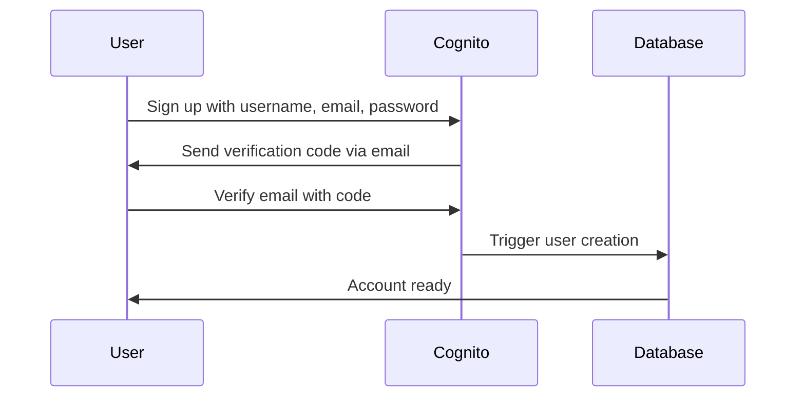
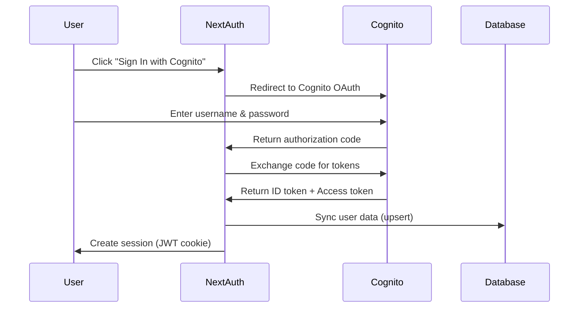
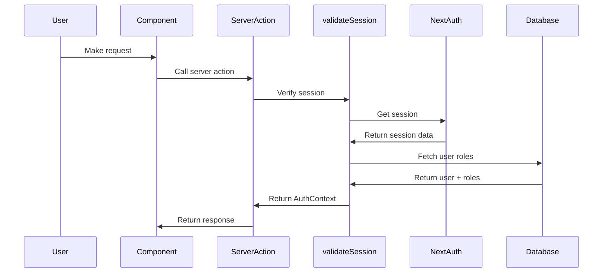

# Authentication Implementation Guide

This guide explains how to use the AWS Cognito authentication system in CertistryLMS.

## Table of Contents

1. [Architecture Overview](#architecture-overview)
2. [Authentication Flow](#authentication-flow)
3. [Using Authentication in Components](#using-authentication-in-components)
4. [Using Authentication in Server Actions](#using-authentication-in-server-actions)
5. [User Management](#user-management)
6. [Role-Based Access Control](#role-based-access-control)
7. [Common Patterns](#common-patterns)

---

## Architecture Overview

### Tech Stack

- **AWS Cognito**: User pool for authentication
- **NextAuth.js 4.x**: Session management and OAuth flow
- **Prisma**: User data persistence
- **PostgreSQL (Neon.tech)**: Database

### Authentication Method

- **Sign-in**: Username-based (users can optionally use email as username)
- **Password Policy**: Min 8 chars, uppercase, lowercase, number, symbol
- **MFA**: Optional (TOTP/SMS)
- **Roles**: `user`, `admin`, `instructor` (stored as Cognito custom attribute)

### Key Files

```
lib/auth/
├── nextauth.config.ts      # NextAuth configuration
├── validateSession.ts      # Session validation for server actions
├── cognito.client.ts       # Cognito admin operations
├── jwt.verify.ts           # JWT token verification utilities
└── types.ts                # Auth types and error classes

app/api/auth/[...nextauth]/
└── route.ts                # NextAuth API routes

components/
└── session-provider.tsx    # Client session provider
```

---

## Authentication Flow

### 1. User Sign-Up



### 2. User Sign-In



### 3. Authenticated Request



---

## Using Authentication in Components

### Client Components (React)

Use the `useSession` hook from `next-auth/react`:

```tsx
// components/MyComponent.tsx
"use client";

import { useSession, signIn, signOut } from "next-auth/react";

export function MyComponent() {
  const { data: session, status } = useSession();

  // Loading state
  if (status === "loading") {
    return <div>Loading...</div>;
  }

  // Not authenticated
  if (status === "unauthenticated") {
    return (
      <button onClick={() => signIn("cognito")}>
        Sign In
      </button>
    );
  }

  // Authenticated
  const user = session.user as any;
  return (
    <div>
      <h1>Welcome, {user.name}!</h1>
      <p>Email: {user.email}</p>
      <p>Role: {user.roles.join(", ")}</p>
      <button onClick={() => signOut()}>Sign Out</button>
    </div>
  );
}
```

### Server Components

Use `getServerSession` directly:

```tsx
// app/dashboard/page.tsx
import { getServerSession } from "next-auth";
import { authOptions } from "@/lib/auth/nextauth.config";
import { redirect } from "next/navigation";

export default async function DashboardPage() {
  const session = await getServerSession(authOptions);

  if (!session) {
    redirect("/api/auth/signin");
  }

  const user = session.user as any;

  return (
    <div>
      <h1>Dashboard</h1>
      <p>Welcome, {user.name}!</p>
    </div>
  );
}
```

### Conditional Rendering by Role

```tsx
"use client";

import { useSession } from "next-auth/react";

export function AdminPanel() {
  const { data: session } = useSession();
  const user = session?.user as any;

  if (!user?.roles.includes("admin")) {
    return <div>Access denied. Admin only.</div>;
  }

  return <div>Admin panel content...</div>;
}
```

---

## Using Authentication in Server Actions

### Basic Authentication (withAccess)

Use `withAccess` for any server action that requires authentication:

```typescript
// modules/books/serverActions/getBooks.ts
import { withAccess } from "@/lib/middleware/withAccess";
import { prisma } from "@/lib/prisma";

export const getBooks = withAccess(async (user) => {
  // user is AuthContext, guaranteed to be authenticated
  const books = await prisma.book.findMany({
    where: { createdById: user.userId },
  });

  return { data: books, success: true };
});
```

### Permission-Based Access (withPermission)

Use `withPermission` for stricter role-based access control:

```typescript
// modules/books/serverActions/deleteBook.ts
import { withPermission } from "@/lib/middleware/withPermission";
import { prisma } from "@/lib/prisma";

// Only users with 'books.delete' permission can call this
export const deleteBook = withPermission("books.delete")(async (
  user,
  bookId: string
) => {
  await prisma.book.delete({
    where: { id: bookId },
  });

  return { success: true };
});
```

### Multiple Permissions Required

```typescript
import { withPermission } from "@/lib/middleware/withPermission";

// User needs BOTH permissions
export const adminAction = withPermission(["admin", "certifications.manage"])(
  async (user, certId: string) => {
    // Only admins with certification management permission
    // can execute this action
  }
);
```

### Optional Authentication

For public endpoints that behave differently for authenticated users:

```typescript
import { getOptionalSession } from "@/lib/auth/validateSession";
import { prisma } from "@/lib/prisma";

export async function getPublicCertifications() {
  const user = await getOptionalSession();

  // Everyone can see active certifications
  const certifications = await prisma.certification.findMany({
    where: { isActive: true },
  });

  // But only authenticated users see their progress
  if (user) {
    // Fetch user progress
  }

  return { data: certifications };
}
```

---

## User Management

### Creating Users Programmatically

```typescript
import { createCognitoUser } from "@/lib/auth/cognito.client";
import { prisma } from "@/lib/prisma";

export async function createStudent(
  username: string,
  email: string,
  name: string
) {
  // 1. Create user in Cognito
  const cognitoResult = await createCognitoUser({
    username,
    email,
    name,
    role: "user",
    sendEmail: true, // Send welcome email with temp password
  });

  // 2. User will be automatically synced to database on first sign-in
  // (NextAuth's JWT callback handles this)

  return { success: true, username: cognitoResult.username };
}
```

### Updating User Role

```typescript
import { updateCognitoUserRole } from "@/lib/auth/cognito.client";
import { prisma } from "@/lib/prisma";

export async function promoteToAdmin(userId: string) {
  const user = await prisma.user.findUnique({ where: { id: userId } });
  if (!user?.cognitoUsername) throw new Error("User not found");

  // 1. Update role in Cognito
  await updateCognitoUserRole(user.cognitoUsername, "admin");

  // 2. Update role in database
  await prisma.user.update({
    where: { id: userId },
    data: { roles: ["admin"] },
  });

  return { success: true };
}
```

### Disabling a User

```typescript
import { disableCognitoUser } from "@/lib/auth/cognito.client";
import { prisma } from "@/lib/prisma";

export async function suspendUser(userId: string) {
  const user = await prisma.user.findUnique({ where: { id: userId } });
  if (!user?.cognitoUsername) throw new Error("User not found");

  // Disable in Cognito (prevents sign-in)
  await disableCognitoUser(user.cognitoUsername);

  // Optionally mark in database
  // (add an 'active' field to User model if needed)

  return { success: true };
}
```

---

## Role-Based Access Control

### Permission Mapping

Permissions are mapped from roles in `lib/auth/validateSession.ts`:

```typescript
const ROLE_PERMISSIONS: Record<string, string[]> = {
  admin: [
    "read",
    "write",
    "delete",
    "users.manage",
    "certifications.manage",
    "content.manage",
    "analytics.view",
  ],
  instructor: [
    "read",
    "write",
    "content.create",
    "content.edit",
    "students.view",
    "analytics.view",
  ],
  user: ["read", "content.view", "progress.manage"],
};
```

### Adding Custom Permissions

1. Update the `ROLE_PERMISSIONS` mapping
2. Use `withPermission` middleware with your custom permission:

```typescript
export const editCertificationContent = withPermission("content.edit")(
  async (user, contentId: string) => {
    // Only instructors and admins can edit content
  }
);
```

### Checking Permissions in Components

```tsx
"use client";

import { useSession } from "next-auth/react";

export function EditButton({ contentId }: { contentId: string }) {
  const { data: session } = useSession();
  const user = session?.user as any;

  // Check if user has required role
  const canEdit =
    user?.roles.includes("admin") || user?.roles.includes("instructor");

  if (!canEdit) return null;

  return <button onClick={() => editContent(contentId)}>Edit</button>;
}
```

---

## Common Patterns

### Protected Route (Server Component)

```tsx
// app/admin/page.tsx
import { getServerSession } from "next-auth";
import { authOptions } from "@/lib/auth/nextauth.config";
import { redirect } from "next/navigation";

export default async function AdminPage() {
  const session = await getServerSession(authOptions);
  const user = session?.user as any;

  if (!user?.roles.includes("admin")) {
    redirect("/unauthorized");
  }

  return <div>Admin content</div>;
}
```

### Protected Route (Client Component with Hook)

```tsx
// hooks/useRequireAuth.ts
"use client";

import { useSession } from "next-auth/react";
import { useRouter } from "next/navigation";
import { useEffect } from "react";

export function useRequireAuth(requiredRole?: string) {
  const { data: session, status } = useSession();
  const router = useRouter();

  useEffect(() => {
    if (status === "loading") return;

    if (status === "unauthenticated") {
      router.push("/api/auth/signin");
      return;
    }

    if (requiredRole) {
      const user = session?.user as any;
      if (!user?.roles.includes(requiredRole)) {
        router.push("/unauthorized");
      }
    }
  }, [status, session, router, requiredRole]);

  return { session, status };
}
```

### Sign Out Button

```tsx
"use client";

import { signOut } from "next-auth/react";
import { Button } from "@/components/ui/button";

export function SignOutButton() {
  return (
    <Button
      onClick={() => signOut({ callbackUrl: "/" })}
      variant="outline"
    >
      Sign Out
    </Button>
  );
}
```

### User Profile Display

```tsx
"use client";

import { useSession } from "next-auth/react";
import { Avatar } from "@/components/ui/avatar";

export function UserProfile() {
  const { data: session } = useSession();
  const user = session?.user as any;

  if (!user) return null;

  return (
    <div className="flex items-center gap-3">
      <Avatar>
        <span>{user.name?.charAt(0) || user.email.charAt(0)}</span>
      </Avatar>
      <div>
        <p className="font-medium">{user.name || "User"}</p>
        <p className="text-sm text-muted-foreground">{user.email}</p>
      </div>
    </div>
  );
}
```

---

## Testing Authentication

### 1. Create Test User in Cognito

Via AWS Console:
1. Go to Cognito User Pool
2. Click "Users" → "Create user"
3. Username: `testuser`
4. Email: `test@example.com`
5. Set temporary password
6. Set custom attribute: `custom:role` = `user`

### 2. Test Sign-In Flow

```bash
# Visit your app
open http://localhost:3000

# Click "Sign In" button (triggers Cognito OAuth)
# Enter username and temporary password
# Change password when prompted
# Redirect back to app with session
```

### 3. Test Server Action with Auth

```typescript
// Test in browser console
const result = await fetch("/api/your-action", {
  method: "POST",
  headers: { "Content-Type": "application/json" },
  body: JSON.stringify({ param: "value" }),
});
console.log(await result.json());
```

---

## Security Best Practices

### 1. Never Expose Tokens to Client

❌ **Wrong**:
```typescript
"use client";
const token = session.accessToken; // FORBIDDEN
```

✅ **Correct**:
```typescript
// Server action
export const secureFetch = withAccess(async (user) => {
  // Use user context, not raw tokens
  const data = await fetchFromAPI(user.userId);
  return data;
});
```

### 2. Always Validate on Server

❌ **Wrong**:
```tsx
// Client-only check
if (user.roles.includes("admin")) {
  deleteUser(userId); // Anyone can call this in browser!
}
```

✅ **Correct**:
```tsx
// Client check for UI only
{user.roles.includes("admin") && <DeleteButton />}

// Server action has real protection
export const deleteUser = withPermission("users.manage")(async (user, id) => {
  // This check happens on server - cannot be bypassed
});
```

### 3. Use HTTPS in Production

Ensure `NEXTAUTH_URL` uses `https://` in production environment variables.

### 4. Rotate NEXTAUTH_SECRET

Generate a strong secret and keep it confidential:

```bash
openssl rand -base64 32
```

Never commit this to version control.

---

## Troubleshooting

### "No session found" error

**Cause**: User not authenticated or session expired.

**Solution**:
- Check if user is signed in
- Verify `NEXTAUTH_SECRET` is set
- Check cookie settings (httpOnly, secure)

### "Invalid token" error

**Cause**: JWT verification failed.

**Solution**:
- Verify `COGNITO_USER_POOL_ID` and `COGNITO_CLIENT_ID` are correct
- Check AWS region matches
- Ensure token hasn't expired

### User not syncing to database

**Cause**: NextAuth JWT callback error.

**Solution**:
- Check Prisma client is initialized
- Verify database connection
- Check console logs for errors in `nextauth.config.ts`

### Permission denied despite having correct role

**Cause**: Role permissions not updated.

**Solution**:
- Check `ROLE_PERMISSIONS` mapping in `validateSession.ts`
- Verify user has correct role in database
- Sign out and sign back in to refresh session

---

## Next Steps

1. ✅ Set up Cognito User Pool (see `AWS_Cognito_Setup_Guide.MD`)
2. ✅ Configure environment variables
3. ✅ Create test user
4. ✅ Test sign-in/sign-out flow
5. ✅ Implement protected routes
6. ✅ Add RBAC to server actions
7. ✅ Build user management UI

## Additional Resources

- [NextAuth.js Documentation](https://next-auth.js.org/)
- [AWS Cognito Documentation](https://docs.aws.amazon.com/cognito/)
- [RBAC Best Practices](https://auth0.com/docs/manage-users/access-control/rbac)
